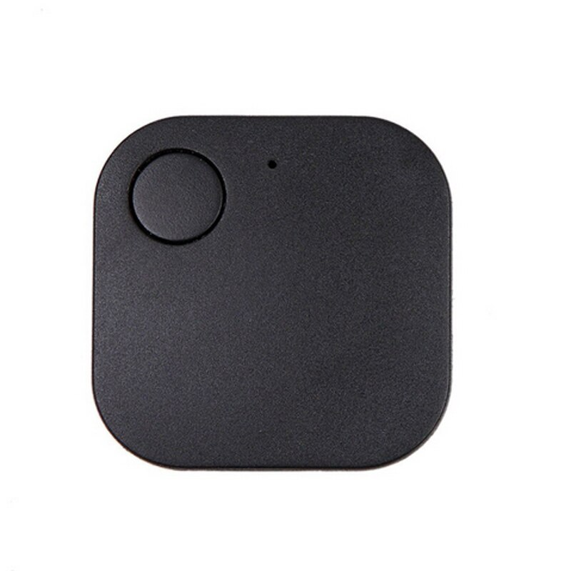

## iTag python script to detect button pushes
Simple script to read iTag button pushes. Originally was [done](https://gist.github.com/bricewge/a38bd4223e407967f6ab78842c3df07e) with `bluepy`, but one of the future ideas is to add this script to `buildroot` and create a minimal image for Raspberry Pi Zero W.



```
Service UUID: 0000ffe0-0000-1000-8000-00805f9b34fb
Charasteristic UUID: 0000ffe1-0000-1000-8000-00805f9b34fb
```

### TODO:
- CTRL-C Exit
- Argument parser
- ~Enigo (simulate key press)~
- Buildroot image for `rpi0w`

### References
- https://gist.github.com/bricewge/a38bd4223e407967f6ab78842c3df07e
- https://github.com/deviceplug/btleplug
- https://github.com/enigo-rs/enigo